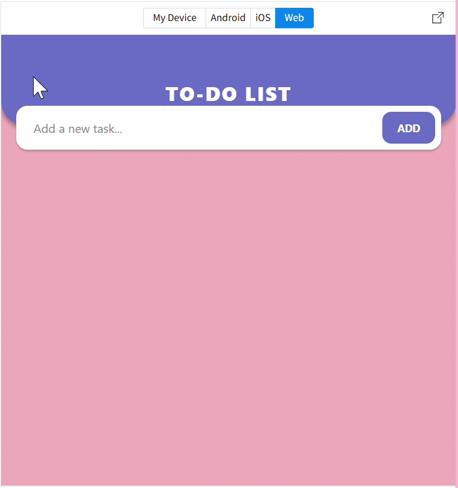
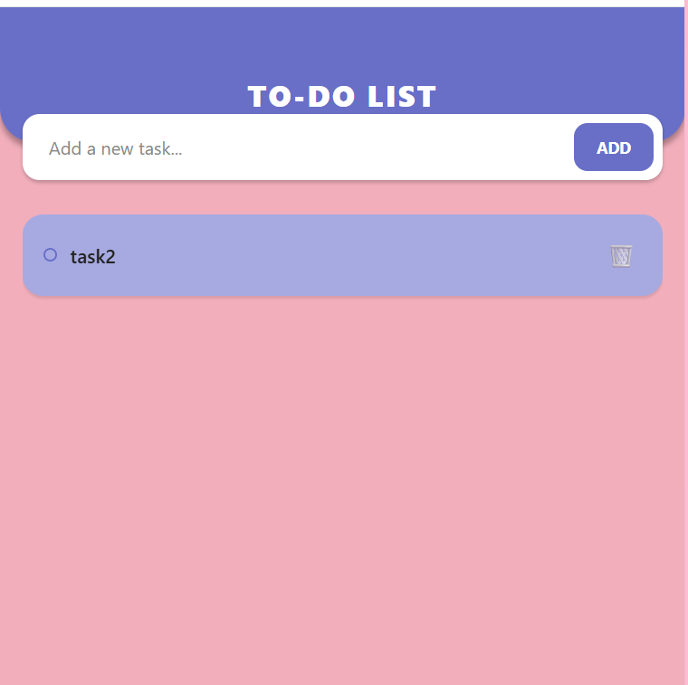

# 🚀 Assignment 01: Interactive To-Do List

<p align="center">
  
  <br>
  <i>(Animated Demo: Watch the application in action automatically)</i>
</p>

---

<p align="center">
  
  
  
</p>

## 📝 Project Overview
This application is a **To-Do List** manager built using **React Native**. Developed within the **Expo Snack** environment, it provides a seamless cross-platform experience with a focus on elegant design and robust state management.

---

## 🎨 Design System & Visual Identity
The UI is built on a custom aesthetic palette to ensure visual harmony and a modern user experience.

* **Theme**: Deep Lavender & Peach Fusion.
* **Color Palette**:
    * **Primary Accent**: `#696FC7` (Used for Header & Buttons).
    * **Main Background**: `#F2AEBB` (Soft Peach Pink).
    * **Active Cards**: `#A7AAE1` (Task Backgrounds).
    * **Completed State**: `#F5D3C4` (Soft Neutral).

---

## 📸 Static Preview (Screenshots)

| 1. Initial State | 2. Adding Tasks | 3. Operations |
|---|---|---|
|  |  |  |

---

## 🛠️ Technical Engineering Features
This project implements high-level architectural patterns in React Native:

1. **State Persistence**: Using `useState` hooks for real-time data binding between input and the task list.
2. **Data Integrity**: Implementing **Immutability** patterns using `.map()` and `.filter()` to manage task lifecycle (Add/Toggle/Delete) safely.
3. **High Performance**: Optimized rendering using the `FlatList` component for efficient memory management during scrolling.
4. **Interactive UI**: Custom feedback loops using `TouchableOpacity` and dynamic conditional styling.

---

## 💻 Core Logic Overview
The following snippet represents the core engine of the application, managing task toggling and data removal:

```javascript
// Toggle Completion Status
const toggleCompleteHandler = (id) => {
  setCourseGoals(prevGoals => 
    prevGoals.map(goal => goal.id === goalId ? { ...goal, completed: !goal.completed } : goal)
  );
};

// Remove Task from List
const deleteGoalHandler = (id) => {
  setCourseGoals(prevGoals => prevGoals.filter(goal => goal.id !== id));
};
