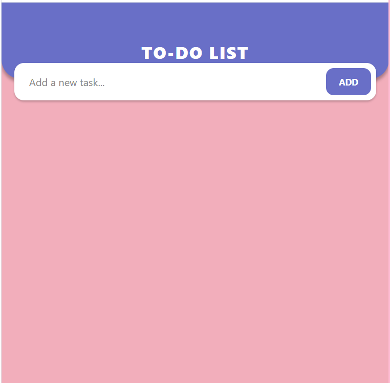
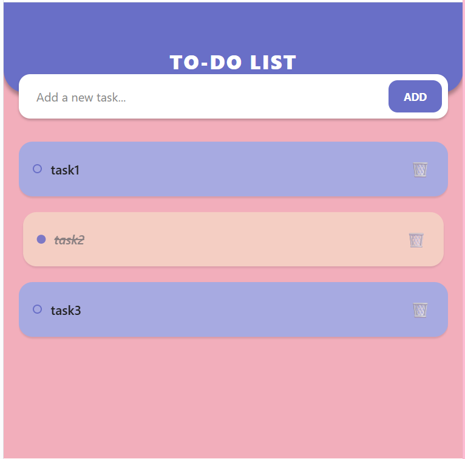

# Assignment 01: Interactive To-Do List 📱

## 📝 Project Description
A modern, responsive To-Do List application built with **React Native** and **Expo**. This app was developed as part of the **Mobile Computing** course assignments for Spring 2026. It focuses on efficient state management, high-performance list rendering, and a clean user experience tailored for mobile devices.

---

## 📸 Application Preview (Screenshots)

| 1. Initial State | 2. Adding Tasks | 3. Completed/Delete |
|---|---|---|
|  |  |  |

> **Note:** Please ensure your screenshot files are named exactly as above in the `assets` folder, or update the names in this table.

---

## 🎥 Live Demo (Video)
You can view the full demonstration of the app's functionality here:
[▶ Click here to watch the Display Video](./assets/display-APP.mp4)

---

## 🎨 Design Philosophy & Color Palette
The UI was designed using a premium color palette to ensure an elegant and modern look, specifically selected for visual clarity.

* **Theme Concept**: Deep Lavender & Peach.
* **Technical Color Specs**:
    * **Header & Primary Buttons**: `#696FC7`
    * **App Background**: `#F2AEBB`
    * **Task Cards (Default)**: `#A7AAE1`
    * **Completed Task State**: `#F5D3C4`

---

## 🛠️ Technical Features
This project implements core React Native architectural patterns:

### 1. Advanced State Management
* **`useState` Hook**: Utilized for real-time tracking of text input and the main tasks array.
* **Dynamic UI Rendering**: The interface updates instantly when tasks are added, marked as done, or removed.

### 2. Functional Logic
* **Validation**: The `addGoalHandler` ensures no empty strings are added to the list.
* **Immutability**: Uses the `.map()` function to toggle task status, ensuring state is updated according to React best practices.
* **Data Removal**: Implements `.filter()` to remove items efficiently via their unique `id`.

### 3. Performance & UI Components
* **`FlatList`**: Used instead of a standard ScrollView to ensure memory efficiency and high performance during list scrolling.
* **`TouchableOpacity`**: Provides native touch feedback for all interactive buttons and task items.
* **Conditional Styling**: Styles change dynamically based on the task’s completion status (e.g., strike-through text and background opacity).

---

## 💻 Core Logic Implementation

```javascript
// Function to toggle task completion status using immutability
function toggleCompleteHandler(goalId) {
  setCourseGoals((currentCourseGoals) =>
    currentCourseGoals.map((goal) =>
      goal.id === goalId ? { ...goal, completed: !goal.completed } : goal
    )
  );
}
